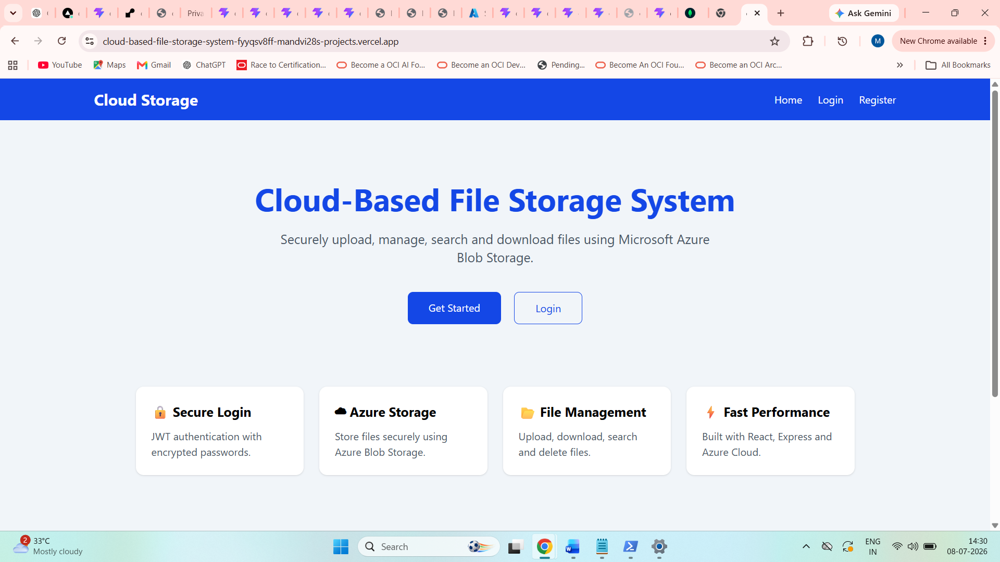
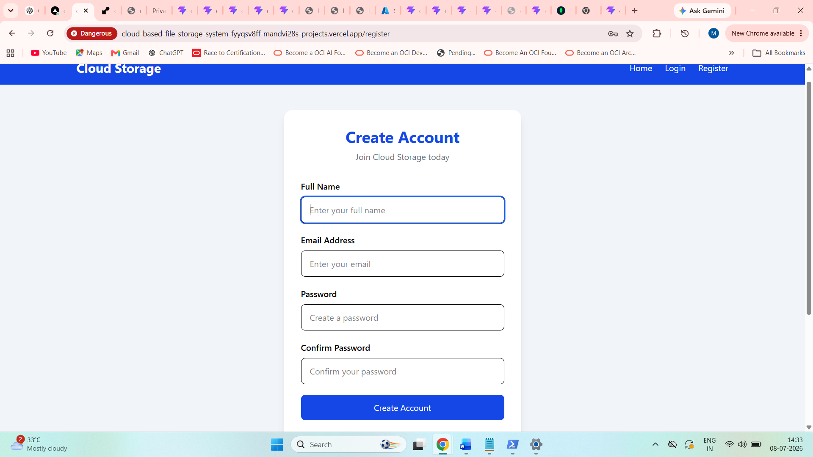
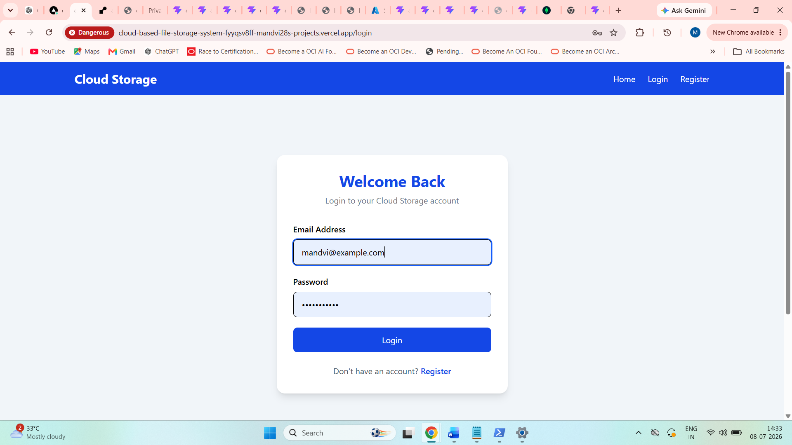
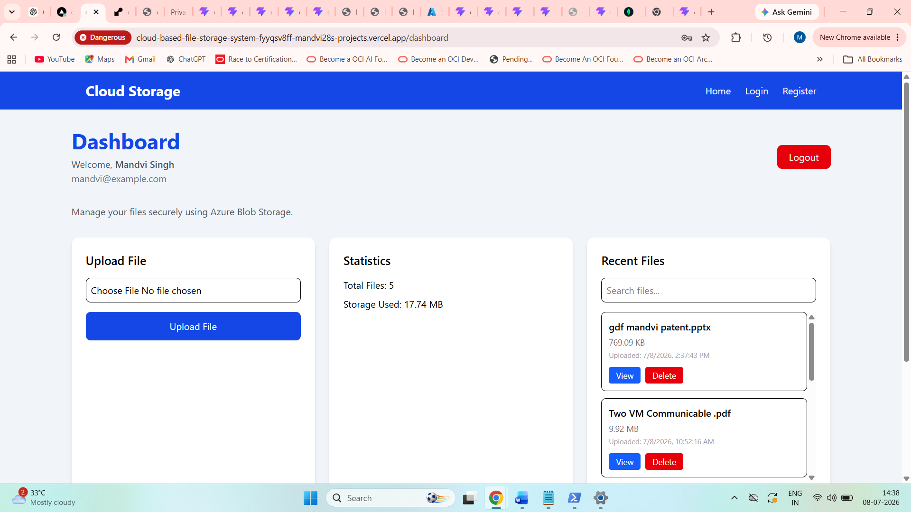
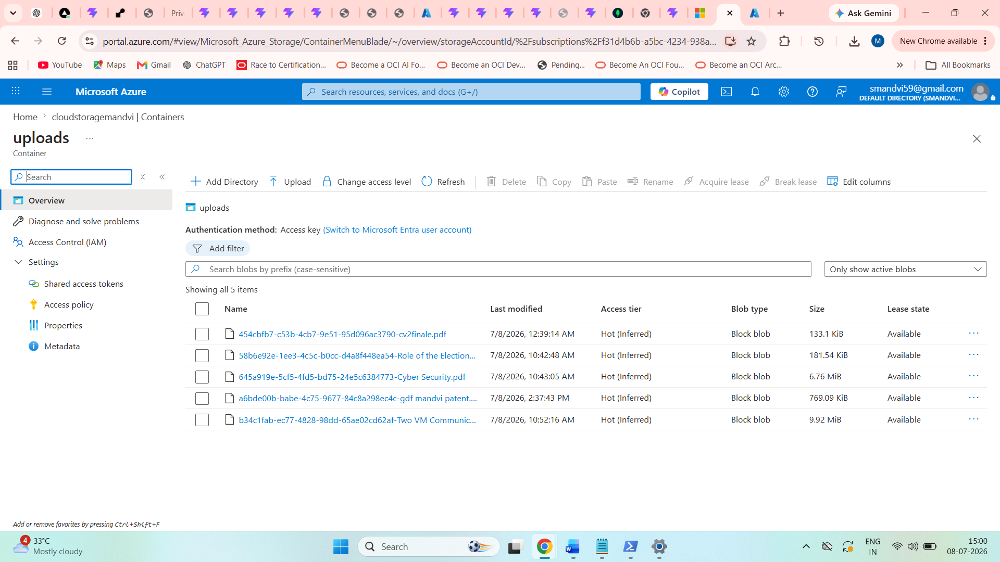
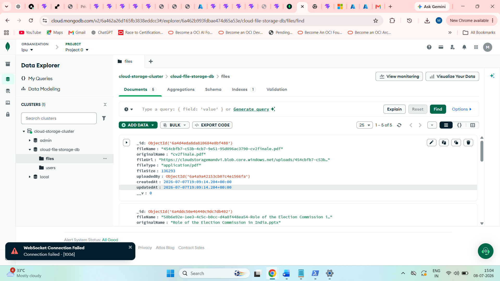

# ☁️ Cloud-Based File Storage System

A modern full-stack cloud application that allows users to securely upload, manage, search, download, and delete files using **Microsoft Azure Blob Storage**.

The application provides secure JWT authentication, cloud-based file storage, MongoDB Atlas integration, and a responsive dashboard built with React and Node.js.

---

# 🌐 Live Demo

### 🚀 Frontend

https://cloud-based-file-storage-system-psi.vercel.app

### ⚙️ Backend API

https://cloud-storage-api-h1kb.onrender.com

### 📂 GitHub Repository

https://github.com/Mandvi28/Cloud-Based-File-Storage-System

---
 # 🎥 Project Demo

Click the image below to watch the complete project demonstration.

[](https://youtu.be/wscSNhYr2nY)

# 📸 Project Preview

## 🏠 Home Page



---

## 📝 Register Page



---

## 🔐 Login Page



---

## 📊 Dashboard


---

## 📤 Upload Files



---

## ☁️ Azure Blob Storage



---

## 🍃 MongoDB Atlas



---

# ✨ Features

## 🔐 Authentication

- User Registration
- User Login
- JWT Authentication
- Password Encryption using bcrypt
- Protected Routes

## 📁 File Management

- Upload Files
- Download Files
- Delete Files
- Search Files
- View Uploaded Files
- Upload Date & Time
- File Size Formatting
- Azure Blob Storage Integration

## 📊 Dashboard

- Total Uploaded Files
- Storage Usage
- Recent Files
- Responsive Dashboard
- Search Functionality

## ☁️ Cloud Integration

- Azure Blob Storage
- MongoDB Atlas
- REST API
- Secure Backend

---

# 🏗️ Project Architecture

```
                 React + Vite
                       │
                       │
                  Axios API
                       │
                       ▼
             Node.js + Express
                       │
          ┌────────────┴────────────┐
          ▼                         ▼
 MongoDB Atlas             Azure Blob Storage
(User & Metadata)          (Actual Files)
```

---

# 🚀 Tech Stack

## Frontend

- React.js
- Vite
- React Router DOM
- Tailwind CSS
- Axios

## Backend

- Node.js
- Express.js

## Database

- MongoDB Atlas

## Cloud Storage

- Microsoft Azure Blob Storage

## Authentication

- JWT
- bcryptjs

## Other Packages

- Multer
- UUID
- dotenv
- CORS

---

# 📂 Folder Structure

```text
Cloud-Based-File-Storage-System
│
├── client/
│   ├── src/
│   ├── public/
│   ├── package.json
│   └── vite.config.js
│
├── server/
│   ├── config/
│   ├── controllers/
│   ├── middleware/
│   ├── models/
│   ├── routes/
│   ├── server.js
│   └── package.json
│
├── screenshots/
│   ├── home.png
│   ├── register.png
│   ├── login.png
│   ├── dashboard.png
│   ├── upload.png
│   ├── azure-storage.png
│   └── mongodb.png
│
├── README.md
└── .gitignore
```

---

# ⚙️ Installation

## Clone Repository

```bash
git clone https://github.com/Mandvi28/Cloud-Based-File-Storage-System.git
```

---

## Install Backend

```bash
cd server
npm install
```

---

## Install Frontend

```bash
cd ../client
npm install
```

---

## Start Backend

```bash
npm start
```

---

## Start Frontend

```bash
npm run dev
```

---

# 🔐 Environment Variables

Create a `.env` file inside the **server** folder.

```env
PORT=5000

MONGO_URI=YOUR_MONGODB_CONNECTION_STRING

JWT_SECRET=YOUR_SECRET_KEY

AZURE_STORAGE_CONNECTION_STRING=YOUR_AZURE_STORAGE_CONNECTION_STRING

AZURE_STORAGE_CONTAINER_NAME=uploads
```

---

# 📡 API Endpoints

## Authentication

| Method | Endpoint |
|---------|----------|
| POST | /api/auth/register |
| POST | /api/auth/login |

---

## Files

| Method | Endpoint |
|---------|----------|
| GET | /api/files |
| POST | /api/files/upload |
| DELETE | /api/files/:id |

---

# 📅 Development Timeline

## ✅ Day 1

- Project Setup
- React + Express
- Tailwind CSS
- Routing
- Authentication UI

## ✅ Day 2

- MongoDB Atlas
- Azure Blob Storage
- JWT Authentication
- Register/Login API

## ✅ Day 3

- File Upload API
- Azure Blob Upload
- MongoDB Metadata
- Protected Routes

## ✅ Day 4

- Dashboard
- Upload Files
- Delete Files
- File Statistics

## ✅ Day 5

- Search
- File Size Formatting
- Production Deployment
- README
- GitHub

---

# 🔮 Future Enhancements

- Multiple File Upload
- Drag & Drop Upload
- File Preview
- Folder Support
- Rename Files
- File Sharing Links
- Dark Mode
- User Profile
- Email Verification

---

# 👨‍💻 Author

**Mandvi Singh**

### GitHub

https://github.com/Mandvi28

---

# ⭐ If you like this project

If you found this project helpful, please consider giving it a ⭐ on GitHub.

It motivates me to build more cloud-based applications.
